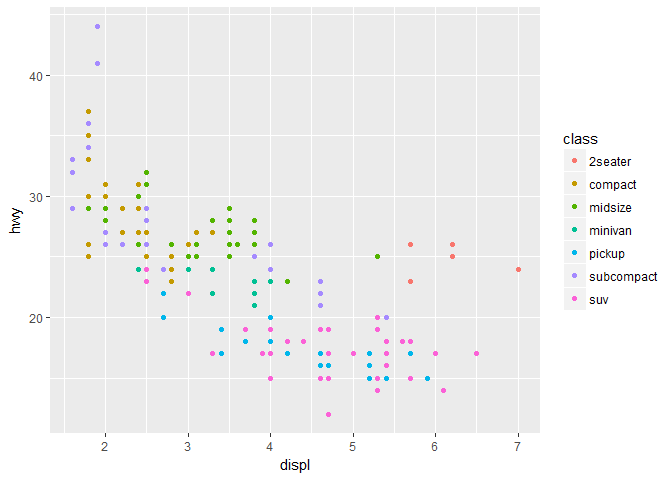

<!-- README.md is generated from README.Rmd. Please edit that file -->
Which information we have?
==========================

``` r
library(ggplot2)

ggplot(mpg, aes(displ, hwy, colour = class)) + 
  geom_point()
```


