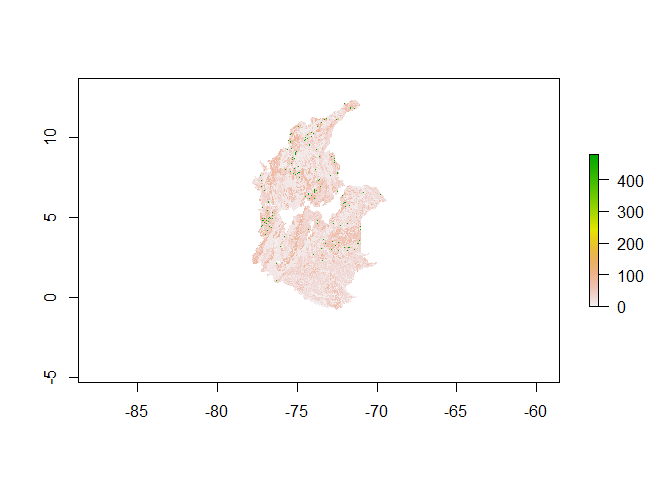

<!-- README.md is generated from README.Rmd. Please edit that file -->
Which information we have?
==========================

Libraries Necessary

``` r
library(tidyverse)
library(raster)
library(foreign)
library(rgdal)
library(spdplyr)
library(stringr)
```

Information about soils that we have

``` r
path_data <- 'D:/CIAT/USAID/Soils/data/'

## Textura informacion CIAT
raster_textura <- raster(paste0(path_data, 'Soil_Colombia/Clasificación textural/Clasificacion textural.tif'))  ## 

plot(raster_textura)
```


